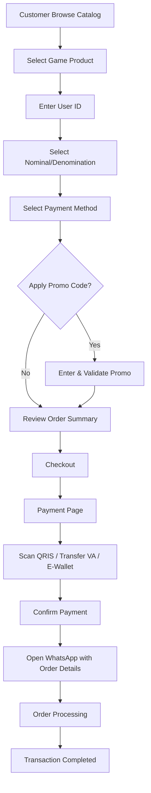
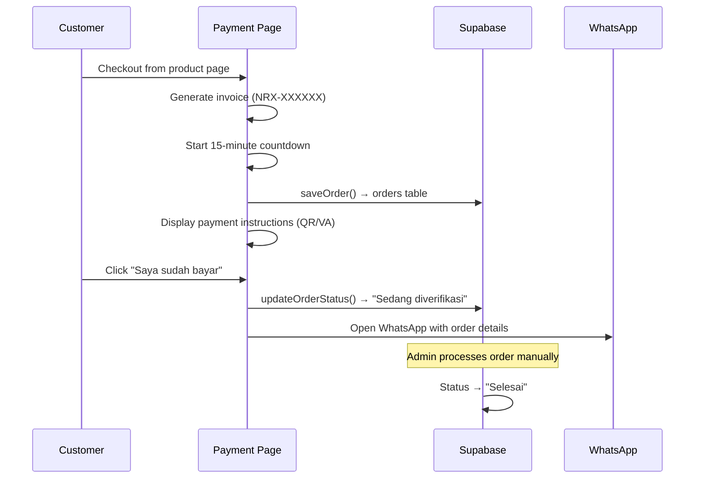

# Noryxa Digital — Digital Commerce Platform Case Study

## Background

Noryxa Digital membutuhkan platform e-commerce digital untuk menjual produk game/top-up secara online. Sebelum platform ini dibuat, operasional penjualan dilakukan secara manual melalui WhatsApp, yang memakan waktu dan sulit di-scale.

Masalah utama yang ingin diselesaikan:

- Proses order manual melalui chat memakan waktu
- Tidak ada self-service untuk customer
- Pengelolaan katalog produk dan nominal tidak terstruktur
- Tidak ada dashboard untuk memantau transaksi
- Sulit mengelola promo dan metode pembayaran

## Product

Platform e-commerce digital untuk produk game/top-up yang terdiri dari:

- **Public Storefront**: Katalog produk, detail produk, checkout, payment
- **Customer Account**: Login, dashboard, transaction history, saved game IDs
- **Admin Dashboard**: Full CRUD untuk products, nominals, payments, promos, orders

## Customer Flow



## Admin Dashboard

Admin dashboard adalah highlight utama platform ini. Dibangun sebagai single-page application dengan 7 tab:

### Overview
- Statistik real-time: total order, pending, selesai, revenue
- Tabel order terbaru dengan shortcut ke halaman orders

### Orders Management
- View semua order dengan filter
- Edit detail order (product, denom, user ID, total, status)
- Update status: Menunggu pembayaran → Sedang diverifikasi → Selesai
- Hapus order

### Product Management
- Tambah/edit/hapus produk
- Upload gambar produk via Cloudinary
- Set kategori, harga, rank, tags (promo, instant, popular, zone, username)
- Enable/disable produk

### Nominal Management
- Filter nominal per game
- Tambah/edit/hapus nominal
- Set harga dan rank per nominal

### Payment Method Management
- Tambah/edit/hapus metode pembayaran
- Upload gambar metode bayar
- Set jenis (QRIS, E-wallet, VA), biaya, dan rank

### Promo Management
- Buat/edit/hapus kode promo
- Set diskon persentase
- Enable/disable promo

### Settings
- Konfigurasi nomor WhatsApp CS
- Nomor ini digunakan di semua tombol "Hubungi CS" di seluruh halaman

## Technical Architecture

```
┌─────────────────────────────────────────────────────────┐
│                      Client (Browser)                    │
│  Next.js 16 App Router + React 19 + Tailwind CSS 4      │
└───────────────────────┬─────────────────────────────────┘
                        │
┌───────────────────────▼─────────────────────────────────┐
│                    Vercel (Deployment)                    │
│  Next.js Server + API Routes                            │
└───┬───────────────────┬─────────────────────────────────┘
    │                   │
┌───▼───────┐   ┌───────▼───────────────────────────────┐
│ Supabase  │   │         External Services              │
│ ─ Auth    │   │  ─ Cloudinary (Image Upload)           │
│ ─ DB      │   │  ─ WhatsApp (wa.me links)              │
│ ─ RLS     │   └───────────────────────────────────────┘
└───────────┘
```

### Key Technical Decisions

1. **Client-side data fetching**: Products, denoms, pays, and promos are fetched client-side from Supabase. This keeps the architecture simple and allows real-time updates without server-side caching complexity.

2. **Server-side signup API**: `/api/auth/signup` uses Supabase service role key to bypass email confirmation, providing instant account creation for customers.

3. **SessionStorage for checkout**: Order data is passed from product detail to payment page via sessionStorage, avoiding URL parameter complexity and keeping sensitive data out of URLs.

4. **Dynamic product inputs**: The product detail page dynamically changes input fields (User ID vs Username vs Zone ID) based on product tags, handling different game requirements without separate pages.

5. **WhatsApp integration**: All customer support flows use direct `wa.me` links with pre-filled messages containing order details, reducing friction for customer support.

## Payment Flow



### Payment Methods Supported
- QRIS (QR code from Cloudinary)
- Virtual Account (BCA, BNI, BRI, Mandiri, Permata)
- E-Wallet (GoPay, DANA, OVO, ShopeePay)

### Order Statuses
1. **Menunggu pembayaran** — Initial state after checkout
2. **Sedang diverifikasi** — Customer confirmed payment, admin reviewing
3. **Selesai** — Order completed, digital product delivered

## Automation

### What's Automated
- Order creation on checkout
- Invoice number generation (NRX-XXXXXX format)
- 15-minute payment countdown timer
- Profile auto-creation on signup (via Supabase database trigger)
- Image upload to Cloudinary (unsigned preset)
- WhatsApp message pre-fill with order details

### What's Manual
- Order processing/fulfillment (admin updates status manually)
- Payment verification (admin confirms payment)
- Digital product delivery (manual process)

## Challenges

### 1. Multi-Game Product Requirements
Different games require different input formats (User ID, Username, Zone ID). Solved with a tag-based system where products have tags like `username`, `zone`, `instant` that dynamically change the UI.

### 2. Denomination Name Matching
Product names in the database sometimes don't match exactly (e.g., "Mobile Legends" vs "Mobile Legends: Bang Bang"). Solved with fuzzy matching in `fetchDenoms()` that falls back to partial string matching.

### 3. Admin Panel Complexity
Building a full admin dashboard within a single page with 7 tabs, each with full CRUD operations, inline editing, and image upload — all while keeping the codebase manageable.

### 4. Payment Page Versatility
The same payment page handles QRIS (with QR image from database), Virtual Account, and e-wallet flows, adapting instructions and UI based on the selected payment method.

### 5. Responsive Design Consistency
Maintaining consistent UX across mobile and desktop with different layouts: mobile gets floating CTA bars and stacked layouts, desktop gets sticky sidebars and two-column layouts.

## Result

### Platform Capabilities
- Customer dapat melakukan top up game secara mandiri 24/7
- Admin memiliki kontrol penuh terhadap produk, nominal, harga, dan promo
- Transaksi tercatat otomatis di database
- Status transaksi dapat dipantau dari dashboard admin dan customer
- Customer support terintegrasi via WhatsApp

### Engineering Highlights
- **49 commits** on main branch with clean, descriptive commit messages
- **Responsive design**: Separate mobile and desktop layouts for key pages
- **Dynamic product system**: Tag-based UI adaptation per game type
- **Full admin CRUD**: Products, nominals, payments, promos — all manageable from admin panel
- **Image management**: Cloudinary integration for product and payment method images
- **Auth system**: Supabase Auth with auto-profile creation, session persistence
- **Custom 404**: Branded not-found page with navigation shortcuts
