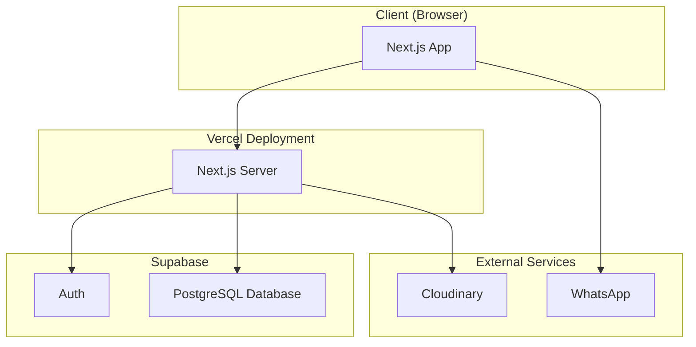

# Noryxa Digital — Digital Commerce Platform

> Platform e-commerce digital untuk produk game/top-up dengan storefront untuk customer dan dashboard admin.

## Live Website

https://www.noryxadigital.net/

## Project Highlights

- Digital product storefront dengan game/top-up catalog
- Responsive design (mobile-first) dengan desktop layout
- Product detail page dengan step-by-step ordering flow
- Payment page dengan QRIS, Virtual Account, dan e-wallet
- Customer authentication (login/register) via Supabase Auth
- Customer dashboard dengan transaction history
- Transaction tracking by invoice number
- Full admin dashboard (products, nominals, payments, promos, orders)
- Image upload via Cloudinary
- WhatsApp customer support integration
- Dynamic promo code system

## Tech Stack

| Layer | Technology |
|-------|-----------|
| Framework | Next.js 16 (App Router) |
| UI | React 19, Tailwind CSS 4 |
| Language | TypeScript |
| Database | Supabase (PostgreSQL) |
| Auth | Supabase Auth |
| Storage | Cloudinary (image uploads) |
| Deployment | Vercel |
| Fonts | DM Sans + Space Grotesk (self-hosted) |

## Customer Experience

### Pages

| Route | Description |
|-------|-------------|
| `/` | Homepage — product catalog, search, category filters, sorting |
| `/product?game={name}` | Product detail — UID input, denomination selection, payment method, checkout |
| `/payment` | Payment page — QRIS/VA/e-wallet instructions, countdown timer, order summary |
| `/track` | Transaction lookup — search by invoice number |
| `/dashboard` | Customer dashboard — profile, transaction history, saved game IDs |
| `/login` | Login / register with email + password |
| `/admin` | Admin dashboard (password protected) |

### Customer Flow

```mermaid
flowchart LR
    A[Browse Catalog] --> B[Select Product]
    B --> C[Enter User ID]
    C --> D[Select Nominal]
    D --> E[Select Payment]
    E --> F[Apply Promo Code]
    F --> G[Checkout]
    G --> H[Payment Page]
    H --> I[Scan QR / Transfer VA]
    I --> J[Confirm Payment]
    J --> K[Order Processing]
    K --> L[Transaction Completed]
```



### Product Catalog

- Category filtering: Semua, Mobile Games, Top Up Cepat
- Tag-based filters: Promo, Instan, Terlaris
- Sorting: Populer, Termurah, Termahal, Nama A-Z
- Search by product name
- Infinite scroll with "Muat Lebih Banyak"

### Product Detail

- Multi-step ordering: User ID → Nominal → Payment
- Dynamic input fields (User ID, Username, Zone ID) based on product tags
- Promo code validation with percentage discount
- Real-time price calculation (base + fee - discount)
- Mobile: floating CTA bar
- Desktop: sticky sidebar with order summary

## Admin Dashboard

Password-protected admin panel at `/admin`.

### Tabs

| Tab | Features |
|-----|----------|
| **Overview** | Total orders, pending, completed, revenue stats + recent orders |
| **Orders** | View all orders, edit order details, update status (Menunggu/Sedang diverifikasi/Selesai), delete orders |
| **Produk** | Add/edit/delete products, upload images via Cloudinary, set category/rank/tags, enable/disable products |
| **Nominal** | Manage denominations per game, set prices and ranks, add/edit/delete |
| **Pembayaran** | Manage payment methods (QRIS, e-wallet, VA), set fees and ranks, upload payment method images |
| **Promo** | Create/edit/delete promo codes, set discount percentage, enable/disable |
| **Settings** | Configure WhatsApp CS number (used across all "Hubungi CS" links) |

### Admin Features

- Product management with image upload to Cloudinary
- Nominal management per game with pricing
- Payment method management with fee configuration
- Promo code management with percentage discounts
- Order management with status updates
- Dynamic WhatsApp number configuration
- Responsive sidebar navigation

## Architecture



### Data Flow

- **Products, Denoms, Pays, Promos**: Fetched from Supabase tables via client-side queries
- **Orders**: Created on checkout, stored in Supabase
- **Auth**: Supabase Auth with email/password, profiles auto-created via database trigger
- **Images**: Uploaded to Cloudinary via unsigned upload preset
- **WhatsApp**: Direct `wa.me` links with pre-filled messages

## Project Structure

```
noryxa-next/
├── src/
│   ├── app/                    # Next.js App Router pages
│   │   ├── page.tsx            # Homepage — catalog
│   │   ├── product/page.tsx    # Product detail
│   │   ├── payment/page.tsx    # Payment page
│   │   ├── track/page.tsx      # Transaction lookup
│   │   ├── dashboard/page.tsx  # Customer dashboard
│   │   ├── login/              # Login & register
│   │   ├── admin/page.tsx      # Admin dashboard
│   │   ├── api/auth/signup/    # Server-side signup API
│   │   ├── layout.tsx          # Root layout
│   │   ├── globals.css         # Global styles + design tokens
│   │   └── not-found.tsx       # Custom 404
│   ├── components/             # Reusable UI components
│   │   ├── AppLayout.tsx       # Main layout wrapper
│   │   ├── Header.tsx          # Top header with search & profile
│   │   ├── Sidebar.tsx         # Navigation sidebar (mobile drawer + desktop)
│   │   ├── ProductCard.tsx     # Product catalog card
│   │   └── RupiahInput.tsx     # Rupiah-formatted number input
│   └── lib/                    # Business logic & integrations
│       ├── supabase.ts         # Supabase client initialization
│       ├── auth.ts             # Authentication functions
│       ├── catalog.ts          # Product, denom, pay, promo fetching
│       ├── orders.ts           # Order CRUD operations
│       ├── cloudinary.ts       # Image upload to Cloudinary
│       ├── data.ts             # TypeScript types & constants
│       └── useSettings.ts      # WhatsApp settings (localStorage)
├── supabase/
│   └── migrations/             # Database migrations
│       └── 001_profiles.sql    # Profiles table + auto-create trigger
├── public/
│   ├── fonts/                  # Self-hosted DM Sans + Space Grotesk
│   └── images/                 # Static images (logo, hero covers)
├── package.json
├── tsconfig.json
├── tailwind.config.ts
└── next.config.ts
```

## Database Schema

Tables managed via Supabase (see `supabase/migrations/`):

| Table | Purpose |
|-------|---------|
| `products` | Game/top-up products (name, category, price, img, rank, tags, active) |
| `denoms` | Denomination options per product (label, price, rank) |
| `pays` | Payment methods (label, kind, fee, rank, img) |
| `promos` | Promo codes (code, disc_pct, active) |
| `orders` | Customer orders (inv, product, denom, uid, pay, total, status, email) |
| `profiles` | User profiles (auto-created on signup via trigger) |

## Environment Variables

Required environment variables (see `.env.local.example`):

```bash
# Supabase
NEXT_PUBLIC_SUPABASE_URL=
NEXT_PUBLIC_SUPABASE_ANON_KEY=
SUPABASE_SERVICE_ROLE_KEY=

# Cloudinary
NEXT_PUBLIC_CLOUDINARY_CLOUD_NAME=
```

## Getting Started

```bash
# Install dependencies
npm install

# Set up environment variables
cp .env.local.example .env.local
# Fill in your Supabase and Cloudinary credentials

# Run development server
npm run dev

# Build for production
npm run build
```

## Scripts

| Command | Description |
|---------|-------------|
| `npm run dev` | Start development server |
| `npm run build` | Build for production |
| `npm run start` | Start production server |
| `npm run lint` | Run ESLint |

## Deployment

Deployed on Vercel. Push to `main` branch triggers automatic deployment.

## License

Private — Noryxa Digital
